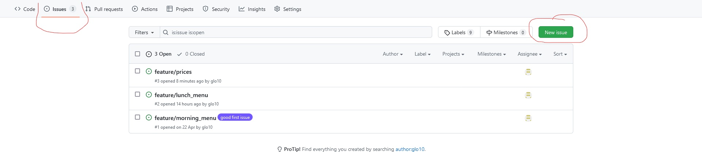
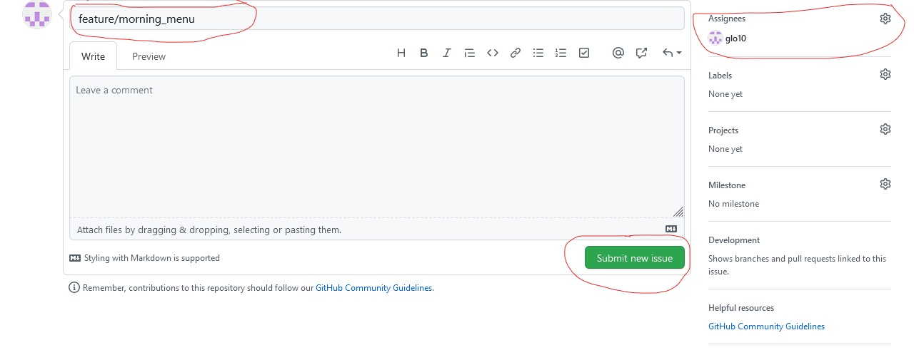

# Exercices en autonomie

## Modalités

- [x] Utilisez la [convention de nommage d'Angular](https://www.conventionalcommits.org/en/v1.0.0/) pour vos messages de commit et vos branches.

---

## JOUR 1

### Partie 1 : les bases

1. Créez un nouveau dossier de travail
2. Initialisez un dépôt git
3. Effectuez la liaison entre votre dépôt local et le dépôt distant sur GitHub, GitLab ou BitBucket
- Il faut créer un nouveau dépôt GitHub
- Ensuite en local, effectuez la commande `git remote add origin [URL_GITHUB_DEPOT_DISTANT]`, en remplaçant *[URL_GITHUB_DEPOT_DISTANT]* par votre URL par exemple par *https://github.com/glo10/16042026_git*
4. Créez un fichier *.gitignore* excluant le dossier *img*.
5. Effectuez votre premier commit
6. Renommez le nom de la branche *master* en *main* 
7. Créez et (dé)placez-vous dans une branche nommée *feature/j1/p1*
8. Créez un dossier *img*
9. Ajoutez le fichier *.gitkeep* dans *img*.
10. Effectuez un commit en respectant la convention de nommage Angular.
11. Créez  un fichier README.md à la racine contenant une liste des objets de votre choix parmi la liste suivante ou à partir de votre imagination débordante :
- Fruits
- Voitures
- Sandwich
- Jeux
- Films
- Etc.
12. Effectuez un ou plusieurs commits sur cette branche *feature/j1/p1*

---

### Partie 2 : consolidation

1. Créez une nouvelle branche *feature/j1/p2*
2. Créez le fichier *README.md* avec une autre liste d'objet.
3. Faites une capture d’écran de l’état de votre dépôt et enregistrez le fichier dans le dossier *img/*.
4. Effectuez un commit de votre travail en respectant les bonnes pratiques de commit [voir l'annexe partie commits](./../annexe.md).
5. Faites  une nouvelle  capture d’écran de votre dépôt et enregistrez le fichier dans le dossier *img/*.
6. Retirez la ligne contenant *img* dans le *.gitignore*.
7. Effectuez un commit

---

### Partie 3 : modifier un message de commit

1. Toujours dans la branche *feature/j1/p2*, effectuez des changements, ajoutez ses changements sans écrire un nouveau message de commit.
2. Modifiez le dernier message de commit par un autre message.

#### Aide

1. Effectuez un commit sans modifier le dernier message de commit : `git commit --amend --no-edit`
2. Effectuez un commit en modifiant le dernier message de commit (sans en créer un nouveau) : `git commit --amend`
- Votre éditeur (celui configuré à l'installation) s'ouvre et vous pouvez éditer votre message puis l'enregistrer.

##### Cas particulier  de léditeur VIM

1. Tapez sur la touche *Echap* puis sur la lettre `i` pour passer en mode édition.
2. Modifier votre message de commit
3. Tapez sur le bouton `Echap` pour quitter le mode d'édition.
4. Tapez sur les touches `:x` pour enregistrer les modifications et quitter l'éditeur.

---

### Partie 4 : fusion des branches

1. Fusionnez la branche *feature/j1/p1* dans la branche *main*.
- En cas de conflit, résolvez le conflit en lisant le diapo du cours 57
2. Fusionnez la branche *feature/j1/p2* dans la branche *main*.
- En cas de conflit, résolvez le conflit en lisant le diapo du cours 57
3. Créez une nouvelle branche *feature/j1/p4* à partir de la branche *main* propre.
4. Modifiez le fichier *README.md* en ajoutant d'autres objets.
5. Effectuez un commit en respectant les bonnes pratiques.
6. Fusionnez la branche *feature/j1/p4* dans la branche *main*.
7. Envoyez toutes vos modifications (branches *feature/j1/p1*, *feature/j1/p2*, *feature/j1/p4* et *main*) vers votre dépôt distant GitHub.

---

### Partie 5 : Dépôt distant

Depuis votre compte GitHub, à partir du dépôt où vous avez envoyé précédemment votre travail.
1. Créez une nouvelle branche *feature/j1/p5* à partir de la branche *main* depuis GitHub.
2. Modifiez le fichier *README.md* en ajoutant encore d'autres objets depuis GitHub et effectuez votre commit.
3. A partir d'ici, toutes les opérations se font en local, récupérez les modifications du dépôt distant (aide commande à effectuer `git checkout -b feature/j1/p5 --track origin/feature/j1/p5`).
5. Fusionnez la branche *feature/j1/p5* dans la branche *main* en local.

---

### Partie 6 : mettre de côté les modifications en cours

1. Créez une nouvelle branche nommée *feature/j1/p6* à partir de la branche *main* en local.
2. Modifiez le fichier *README.md*  en ajoutant d'autres objets.
3. Mettez votre travail de côté (à l'aide de la commande `git stash`)

---

### Partie 7 : tag et application des modifications mises de côté

1. Créez une nouvelle branche nommée *feature/j1/p7*  à partir de votre branche *main*.
2. Modifiez le fichier *README.md* en ajoutant encore d'autres objets.
3. Effectuez un commit en respectant les bonnes pratiques
4. Revenez sur la branche *feature/j1/p6*.
5. Récupérez le travail mis de côté (`git stash apply`) et effectuez un nouveau commit
6. Fusionnez la branche *feature/j1/p6* dans votre branche *feature/j1/p7*.
7. Résolvez le conflit et effectuez un commit de résolution de conflit.
8. Fusionnez la branche *feature/j1/p7* dans la branche *main*.
9. Ajoutez une version(tag) au dernier commit (`git tag v1.0.0`)
10. Analysez l'état de votre dépôt à l'aide de la commande `git log`
11. Envoyez toutes vos branches locales vers votre dépôt distant GitHub 
12. En local, supprimez toutes les branches sauf la branche *main* (pour supprimer une branche `git branch -d branch_name`)

PS : avec l'option `-d`, s'il y a des travaux qui n'ont pas été mergé sur la branche principale, *Git* empêchera la suppression. 
Avec l'option `-D`, la suppression est immédiate peu importe l'état de la branche.

---

### Partie 8 : patch

Un collègue est très intéressé par l'un de vos objets que vous avez ajouté précédemment et l'aimerait le récupérer sur un autre projet à lui.

1. Depuis la documentation de la commande `git format-patch`, créez un patch de plusieurs commit incluant le commit ayant ajouté le fameux objet dans le projet. L'extraction de votre patch doit se faire dans le dossier */patches* à la racine de votre projet.
2. Créez un nouveau projet *Git*, en dehors du projet en cours.
3. Effectuez un premier commit sur ce nouveau dépôt.
4. Copiez/collez le dossier *patches/* d'un dépôt (celui d'extraction) à l'autre (vers le nouveau, celui qui va l'appliquer) 
5. Appliquez uniquement le patch ayant introduit le fameux objet et ignorez les autres fichiers du dossier */patches*.

---

## JOUR 2

***Lisez le sujet jusqu'à la fin avant de commencer SVP*** 

Vous allez préparer les fêtes de fin d'année pour cela, vous avez décidé de tout planifier avec une liste des tâches, les recettes, la playlist musicale et des animations.

PS : Partie I à V en local, Partie VI depuis GitHub

### Partie 1 : planter le décor

0. Créez un nouveau projet *Git*
1. Pour chaque élément, créez une nouvelle branche et ajoutez le contenu puis effectuez un commit.
Les différents fichiers sont :
- **TODO.md**
- **menu.md**
- **playlist.md**
- **animation.md**
2. Votre entourage vous demande de créer une nouvelle playlist, vous décidez de créer une nouvelle playlist dans une nouvelle branche avec toujours la même appellation (playlist.md) et au même emplacement dans votre arborescence des dossiers
3. Vous avez fini de remplir le contenu de vos fichiers depuis leur branche respective, vous décidez de tout fusionner dans *main* et résoudre le conflit sur les playlists

### Partie 2 : modifier votre historique

4. Vous décidez de faire un rebase pour n'avoir qu'un seul commit de toutes les modifications que vous avez effectué sur votre projet en utilisant la commande `git rebase --help` pour lire la documentation de cette commande et bien l'utiliser dans notre contexte

### Partie 3 : partager votre travail dans un dossier d'extraction

5. Votre ami(e) vous demande de lui partager des fichiers d'extractions de votre travail pour qu'il puisse les s'inspirer de votre travail pour ses préparatifs.

### Partie 4 : Mettre de côté les films et séries

6. Vous créez une nouvelle branche pour faire une sélection des films et séries à regarder durant ses vacances de fin d'année dans un fichier *netflix.md*.
A 20% de la fin de cette liste, votre entourage vous demande de modifier la playlist. Pour ne pas perdre votre travail en cours, vous avez décidé :
- tout d'abord, de mettre de côté vos modifications
- ensuite, de modifier la playlist
- enfin, de revenir sur la branche dédiée aux films et séries pour terminer votre travail.

### Partie 5 : tags

7. Vous décidez de versionner votre projet en y ajout des tags

### Partie 6 : GitHub

8. Vous créez un dépôt distant ***PUBLIC*** sur GitHub pour envoyer tout votre travail
9. Depuis GitHub, vous créez une nouvelle branche pour apporter une correction à votre menu
10. Vous récupérez cette nouvelle branche en local pour y ajouter vos corrections

### Partie 7 : *issue*

11. Vous partagez votre dépôt distant à **glo10**(invitation collaborateur sur GitHub avec le pseudo glo10) pour lui demander son avis en créant une issue depuis GitHub et l ›assigner à *glo10*.

#### Aide pour créer un *issue*

### Partie 8 : défaire et modifier un commit

12. Finalement, les films et séries s'avèrent ne pas être une bonne idée, vous préférez faire des activités à l'extérieur, vous décidez de défaire uniquement les changements effectués lors de l'ajout du fichier *netflix.md*
Répondez à cette question sur les scénarios ci-dessous sans les implémenter forcément :
- scenario 1 : Les modifications n'ont pas été envoyées sur *GitHub* et vous n'avez pas effectué de fusion dans la branche *main*
- scenario 2 : même conditions que l'scenario 1 à la différence que vous souhaitiez garder la branche feature/netflix dans votre projet sans conserver les modifications effectuées
- scenario 3 : vous avez envoyé les modifications de la branche *feature/netflix* sur *GitHub*
- scenario 4 : vous avez fait un merge de *feature/netflix* dans *main*
13. Le message de commit crée lors de l'action précédente ne vous convient pas, vous décidez de le supprimer ou de le modifier avant d'envoyer vos dernières mises à jour en ligne.