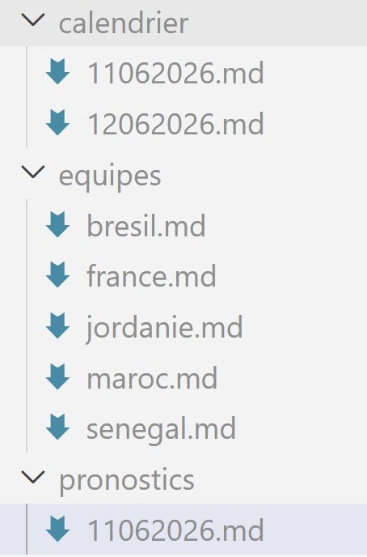
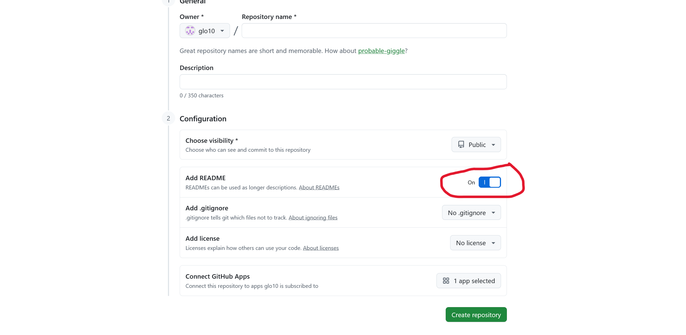
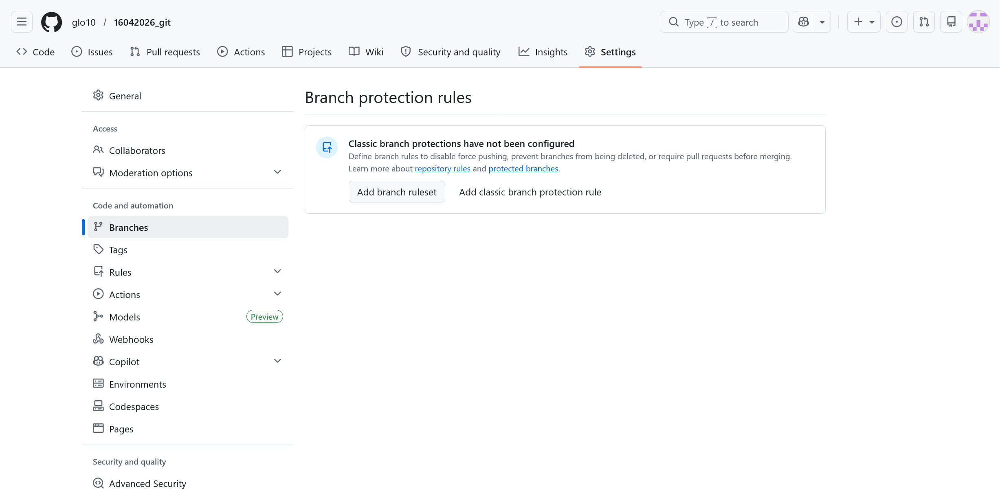
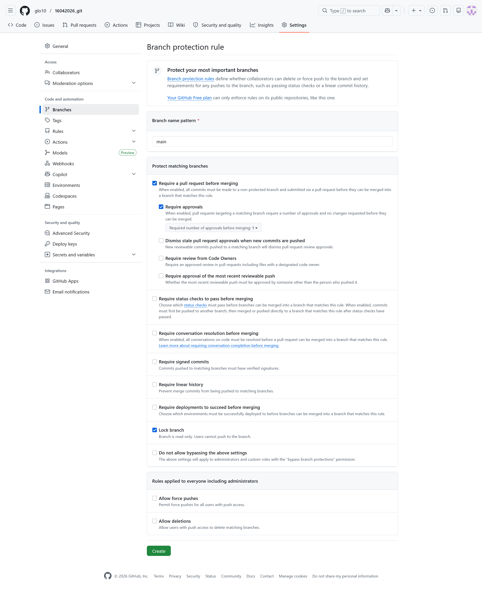
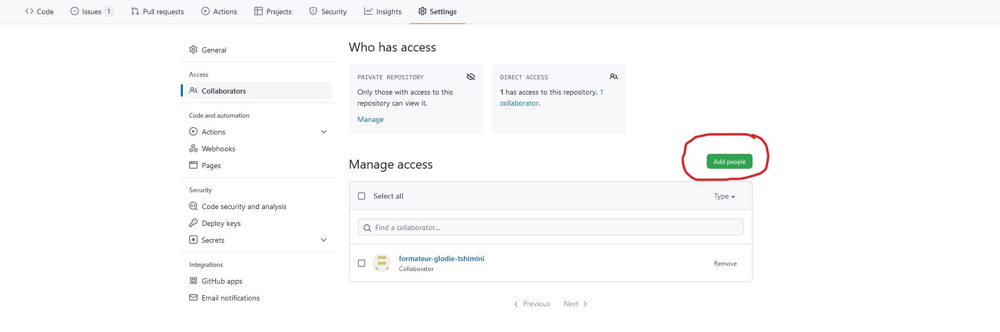

# TP validation des acquis : Coupe du monde 2026

## Prérequis et recommandations

- Lisez dans son intégralité le sujet avant de commencer
- Respectez la convention de nommage [Angular](https://www.conventionalcommits.org/en/v1.0.0/)
- Commit et branches idéalement Anglais
- Vous ne travaillez pas directement sur la branche *main*

---

## Objectifs 

- [x] Le travail collaboratif en binôme ou trinôme avec Git & GitHub
- [x] Commandes de base de Git
- [x] Gestion des conflits
- [x] La manipulation des branches locales & distantes
- [x] Les tags
- [x] L'application de patchs
- [x] La recherche par dichotomie
- [x] Régler des conflits

---

## Contexte

Vous travaillez en binôme ou trinôme pour créer un dépôt Git contenant les fichiers Markdown décrivant la compétition de la **Coupe du monde 2026** :

Vous pouvez utiliser les données [d'EuroSport](https://www.eurosport.fr/football/coupe-du-monde/calendrier-resultats.shtml) pour avoir un échantillon des informations (équipes, calendrier, etc.).
Votre aborescence des dossiers se composent des dossiers suivants : 

- `calendrier/` : dossiers contenant chaque journée nommée par la date du match au format ***jjmmaaaa*** par exemple *18062026.md* et dont le contenu est le calendrier des matchs du jour concerné.
- `pronostics/` : dossiers contenant vos pronostics de chaque journée nommée par la date du match en respectant le format ***jjmmaaaa*** par exemple *18062026.md* et dont le contenu est votre pronostic sur les matchs du jour concerné.
- `equipes/` : un fichier par équipe et nommé par le nom de l'équipe par exemple *france.md*, *senegal.md*, etc.

### Illustration de l'arborescence de vos fichiers et dossiers

---

## Travail à réaliser

### Partie I : création du dépôt par une seule personne du binôme ou trinôme

1. Créez un dépôt GitHub **en cochant la case add README.md**. Cela permet d'avoir directement le premier commit et permettre aux autres de pouvoir manipuler les branches immédiatement après le clone.

2. Protégez la branche main depuis ***Settings > branches > add classic branch protection rule*** en cochant les règles suivantes
- [x] Require a pull request before merging 
- [x] Require approvals
- [x] Lock branch

3. Depuis ***Settings > Access > Collaborators > add people***, ajoutez les autres membres en tant que collaborateur à partir de leur pseudo sur GitHub et ajoutez le formateur dont le pseudo est *glo10*.

4. Acceptez l'invitation depuis l'e-mail envoyé par GitHub au compte associé à votre compte.
5. En local, **tout le monde clone le dépôt**.

---

# Partie II : création des fichiers en simultanée

1. Répartissez-vous les tâches
- 1 collaborateur crée une nouvelle branche *feature/teams* pour créer les équipes
- 1 autre collaborateur crée une nouvelle branche *feature/calendar* pour créer les jours de compétition
- **Tous les collaborateurs** font leurs pronostics dans une branche dédiée associée à leur prénom *feature/predications/votre-prenom* sans se concerter sur les scores.
2. Chaque collaborateur envoie ses modifications en ligne et demande à intégrer ces modifications dans la branche principale un(e) *pull request* en l'assignant à un autre collaborateur.
3. Chaque collaborateur récupère au fur à mesure les mises à jour effectuées depuis le dépôt distant.

---

## Partie III : résolution des conflits

1. Une fois que tout le monde a effectué ses pronostics, en local depuis un seul poste (un seul collaborateur fait la manipulation et les autres l'assistent), vous devez fusionner toutes les branches *feature/predications/\** dans *main* et résoudre les conflits ensemble.
2. Toujours en local et toujours avec un seul collaborateur qui effectue les manipulations, ajoutez un nouveau tag à votre projet avec la version *v1.0.0*.
3. Envoyez ce tag sur GitHub.

---

## Partie IV : application des patchs avec cherry-pick

1. Chaque collaborateur crée une nouvelle branche nommée *feature/the-winner/votre-prenom*
2. Dans cette branche, chaque collaborateur crée un dossier ***winners/***
3. A l'intérieur de ce dossier, chaque collaborateur crée un fichier *[votre-prenom].md* contenant son pronostic de l'équipe gagnante et effectue un commit.
4. Chaque collaborateur applique cette modification dans *main* par l'utilisation de la commande `git cherry-pick`
5. Ajoutez un nouveau tag à votre projet.

---

## Partie V : nettoyage

1. Si ce n'est pas déjà fait, effectuez tous les merges des autres branches dans *main* en local
2. Sur GitHub, supprimez toutes autres branches et gardez uniquement la branche *main*
3. Supprimez également les autres branches que *main* en local dans chaque dépôt git local

---
<!-- 
## Partie VI : introduction d'un bug dans le calendrier

1. Le collaborateur *glo10* a introduit un bug dans l'un des fichiers de votre projet (il vous communiquera précisément le nom du fichier) depuis la branche *feature/calendar/bug*.
2. Récupérez en local cette branche et recherchez quand est-ce qu'à été introduit le mot ***bug*** dans le fichier. -->

